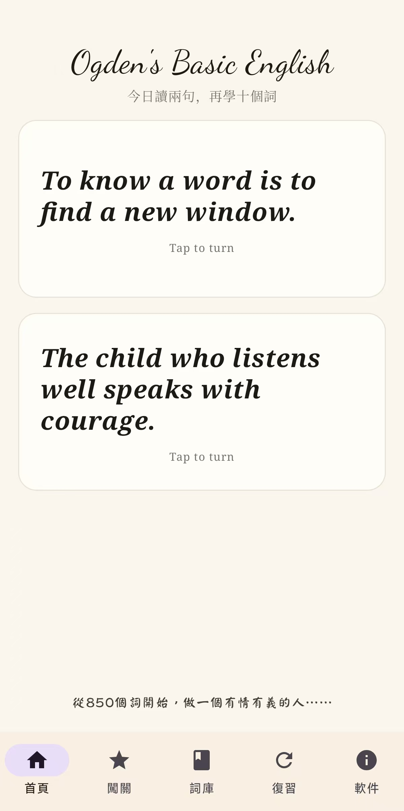
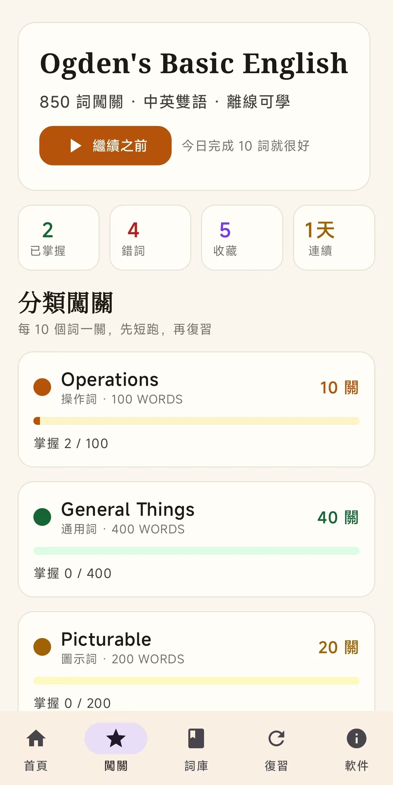
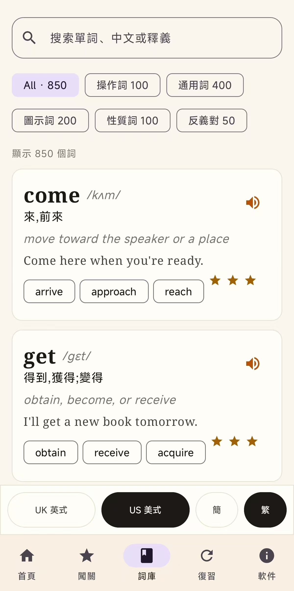
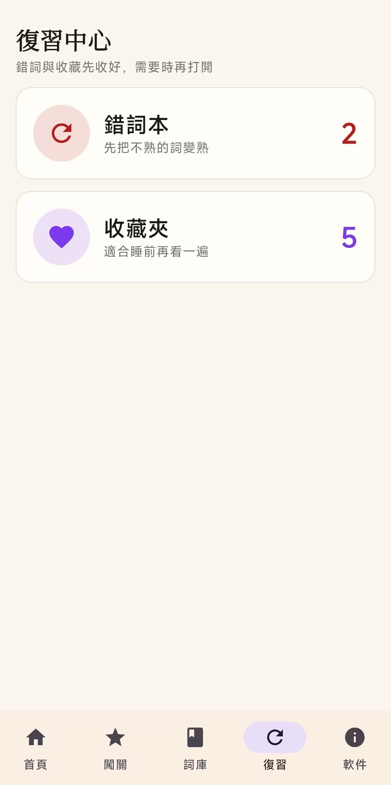

# Ogden Basic

一款面向中文英语学习者的原生 Android 单词 App，基于 Kotlin + Jetpack Compose 构建。它围绕 Ogden Basic English 的 850 个基础词展开，把词库、发音、闯关和复习都放在离线可用的移动端体验里。

> 本项目是一次二次创作。我在 X 上看到 [Ogden's Basic English](https://ogden.munch.love/) 的作品后很受触动，并在征得原网站作者同意的情况下，将其内容与气质重新设计为 Android 学习应用。原作地址：[https://ogden.munch.love/](https://ogden.munch.love/)

欢迎大家下载、使用并反馈。作者 X 账号：[@Skivein](https://x.com/Skivein)

## Screenshots

| Home | Challenge |
| --- | --- |
|  |  |

| Library | Review |
| --- | --- |
|  |  |

## Features

- 内置 Ogden Basic English 850 词，支持离线学习。
- 词库分为 Operations、General Things、Picturable、Qualities、Opposites。
- 支持搜索、分类筛选、US/UK 发音切换，界面固定简体中文。
- 首页展示英文谚语卡片，点击翻转查看中文翻译。
- 每 10 个词为一关，分类逐步解锁。
- 练习包含听音选词、看中文选英文、例句填空、拼写挑战、近义词配对。
- 本地保存学习进度、收藏、错词、熟练度和连续学习天数。
- 复习中心提供错词本和收藏夹。
- 内置 US / UK 两套单词音频，优先离线播放。

## Word Data

词库总数为 850：

- Operations: 100
- General Things: 400
- Picturable: 200
- Qualities: 100
- Opposites: 50

主要数据文件：

- `app/src/main/assets/ogden_words.json`
- `app/src/main/assets/ogden_ipa.json`
- `app/src/main/assets/audio/us`
- `app/src/main/assets/audio/uk`

## Build

使用 JDK 17。用 Android Studio 打开本目录，等待 Gradle 同步后运行 `app`。

命令行构建：

```powershell
.\gradlew.bat :app:testDebugUnitTest :app:assembleDebug --no-parallel
```

APK 输出位置：

```text
app/build/outputs/apk/debug/app-debug.apk
```

## Notes

- App 首版以离线学习为主，不接入账号、云同步或排行榜。
- 发音优先使用内置音频；例句或缺失音频场景可回退到系统 TTS / 在线服务。
- 一点颜体字体来自 [wordshub/free-font](https://github.com/wordshub/free-font)，用于首页底部短句。

## License

本项目以 [MIT License](LICENSE) 开源。
